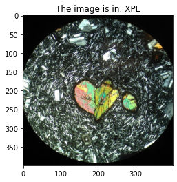
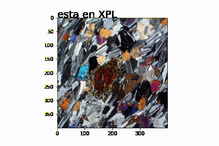
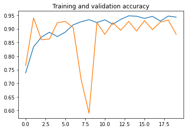
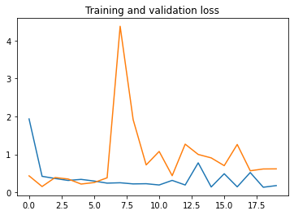

# Simple CNN Thin Section XPL or PPL Classifier
 
Trained model (contained in model folder) where an .h5 keras model is used for distinguishing between PPL and XPL thin sections

### Example of result given in the notebook (.ipynb)

### Result of classification on XPL and PPL in test images

## On the model elaboration:

The model was trained on 2180 images (1140 XPL, 1140 PPL), due to a lack of computational power I reduced the image quality from around 1000x1000 px to 400x400px to train the model. All images are RGB.

The Training dataset and valitadion dataset were splitted 80% - 20% and data augmentation was used (width shift, height shift, zoom, flip).

### Accuracy on training set: 94%
### Accuracy on validation set: 88%

### Training and Validation Accuracy

Maybe should have continued with more epochs... 

### Training and Validation Loss

